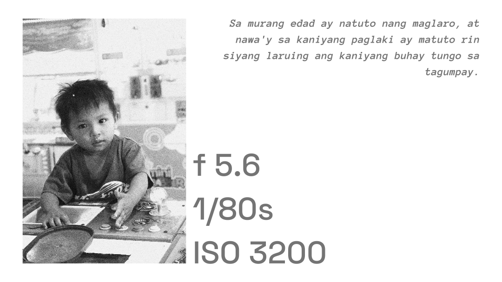

+++
title = "Feature: Captured with a Kit Lens"
path = "kitlens"
date = "2024-02-09"
draft = true 
description = "PJF14—A CIS Photojournalist bagged gold" 
[extra]
[taxonomies]
tags = ["Feature"]
+++

## PJF14 — A CIS Photojournalist Captured the 1st Rank Using a Kit Lens

 

*"He is a great man who uses earthenware dishes as if they were silver; but he is equally great who uses silver as if it were earthenware."*


During the **Region 1 Higher Education Press Conference (RHEPC)**, which was held last February 7, 8, and 9, 2024 in **Hotel Linda Suites, Vigan City, Ilocos Sur**, **Richard Andrew O. Prias**, the respected Student-Body Governor of the College of Information Systems, was awarded a medal for garnering the **First Place on the Filipino Photojournalism Competition**. He, therefore, will be one of the journalists that will represent Region I on the upcoming **Luzon-Wide Higher Education Press Conference (LHEPC)**, that is set to commence on **March 19, 20, and 21, 2024** on **Naga City, Camarines Sur, Philippines**. 

This article aims to inspire budding photojournalists by presenting our champ's pieces while providing a **comprehensive analysis** on his style and techniques, highlighting thence the value of **skill** over **gear**.

## The Winning Pieces

The camera he used was our College's humble **Canon EOS 700D** with its **18-55 mm kit lens**. They were instructed to shoot within the scope of Vigan's heritage sites while having to choose from the subjects of **street photography, occupational photography, human emotions, to a more macro category of flower photography.**

 
 
 
 
 
